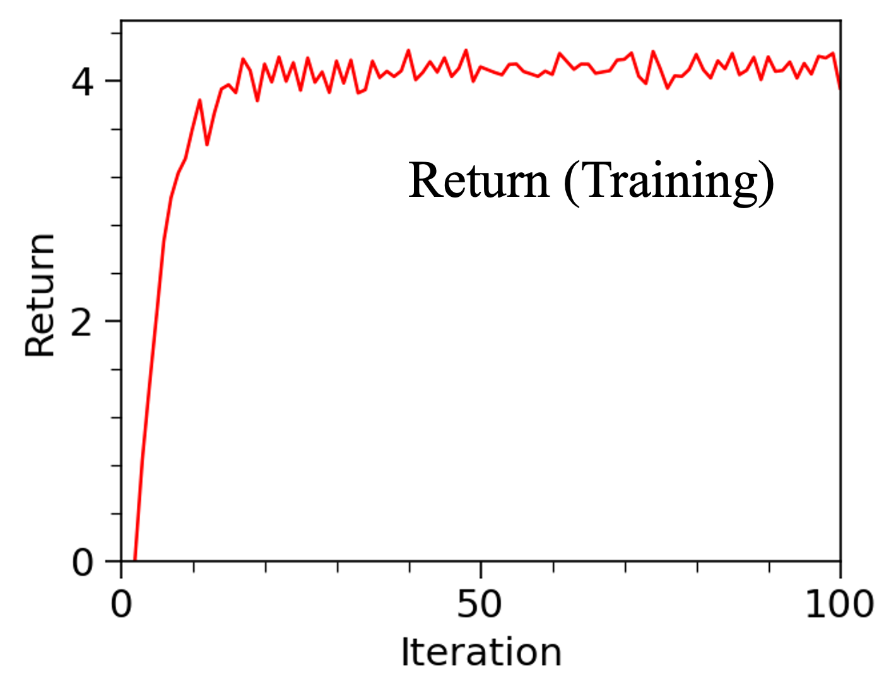
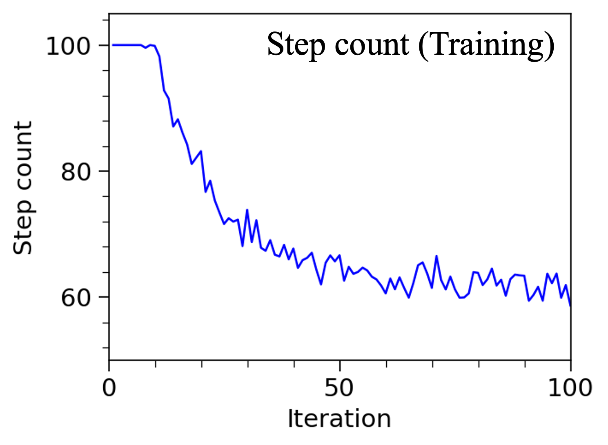
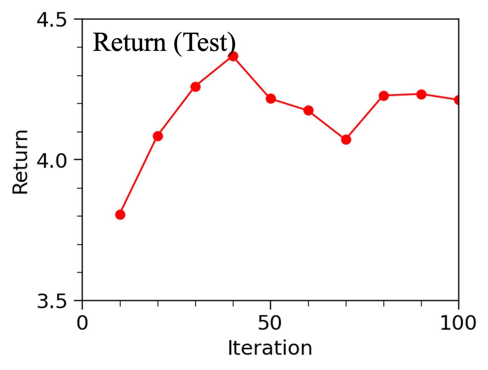
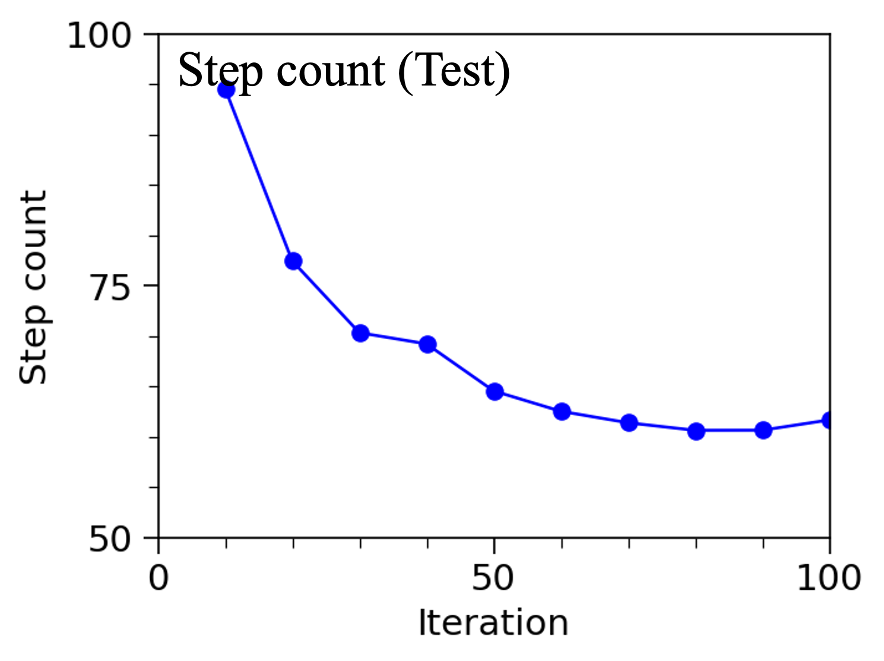

## General
This example demonstrates training multi-agent systems using reinforcement learning algorithms. 

## Dataset
The simulation environment is Navigation of VMAS (VectorizedMultiAgentSimulator). The observations are 18 dimensional which consider the agent position/velocity, the relative agent position with respect to its goal, 12 LiDAR readings. The actions are 2 dimensional which consider the force applied on the agent. The reward consists of three parts: (1) agent reward accounts for the difference between agent-goal distances at two consecutive steps, (2) collision penalty accounts for the penalty from collisions, (3) final reward accounts for a reward obtained when all agents reach their own goals. 

The agent is trained for 100 iterations, each of which considers 6K frames. Thus, 600K frames are used totally.

Simulation Environment Link: https://github.com/proroklab/VectorizedMultiAgentSimulator/

## Model
The model is MAPPO (Multi-Agent Proximal Policy Optimization) which applies PPO algorithm to the multi-agent systems. Compared with the PPO used in uni-agent system, the MAPPO adopts the idea of centralised training and decentralised execution for training the multi-agent systems. Centralised training means the critic model takes the global observation, or the concentation of local observations from all agents, as inputs for evalating the godness of selected actions, which is used during the training process. Meanwhile, decentralised execution means the actor model takes the local observation to generate action distribution for each agent, which is used for sampling trajectories. As a comparison, if the critic model also ultilize local observations, instead of global observations, the model turns into IPPO (Independent Proximal Policy Optimization). 

## Evaluation
| Train Return | Train Step Count |
|---|---|
|  |  |

**Figure 1. Average return and number of steps during training.**

| Test Return | Test Step Count |
|---|---|
|  |  |

**Figure 2. Average return and number of steps during testing.**

| 10 Iterations | 80 Iterations |
|---|---|
|<video src="https://github.com/user-attachments/assets/53156727-d4d4-477c-99cd-f6be7400372e" height="200"></video> | <video src="https://github.com/user-attachments/assets/7f70c71f-e12a-43f2-b536-6cd3ab96dbc2" height="200"></video> |

**Video 1. Navigation of four agents from models after training for 10 iterations (left) and 80 iterations (right).**

Figure 1,2 shows the average return and number of steps during training and testing stages. During training, the actor model is saved every 10 iterations. During testing, each saved model is used to generated 100 trajectories, each of which has at most 1000 steps. The average returns and number of steps are shown in Figure 2 for various checkpoints, indicating the enhanced model performance with the increasing of training iterations. 

The Video 1 shows two videos recording the movements of the inverted double pendulum from the model trained for 40 and 90 iterations, respectively. After training for 40 iterations (left video), the double pendulum can maintain stable within few steps but eventaully fails. However, after training for 90 iterations (right video), the double pendulum keeps stable during the 1000 steps applied.

## Reference
1. https://gymnasium.farama.org/index.html
2. Yu, Chao, et al. "The surprising effectiveness of ppo in cooperative multi-agent games." Advances in Neural Information Processing Systems 35 (2022): 24611-24624..
3. https://pytorch.org/tutorials/intermediate/reinforcement_ppo.html
