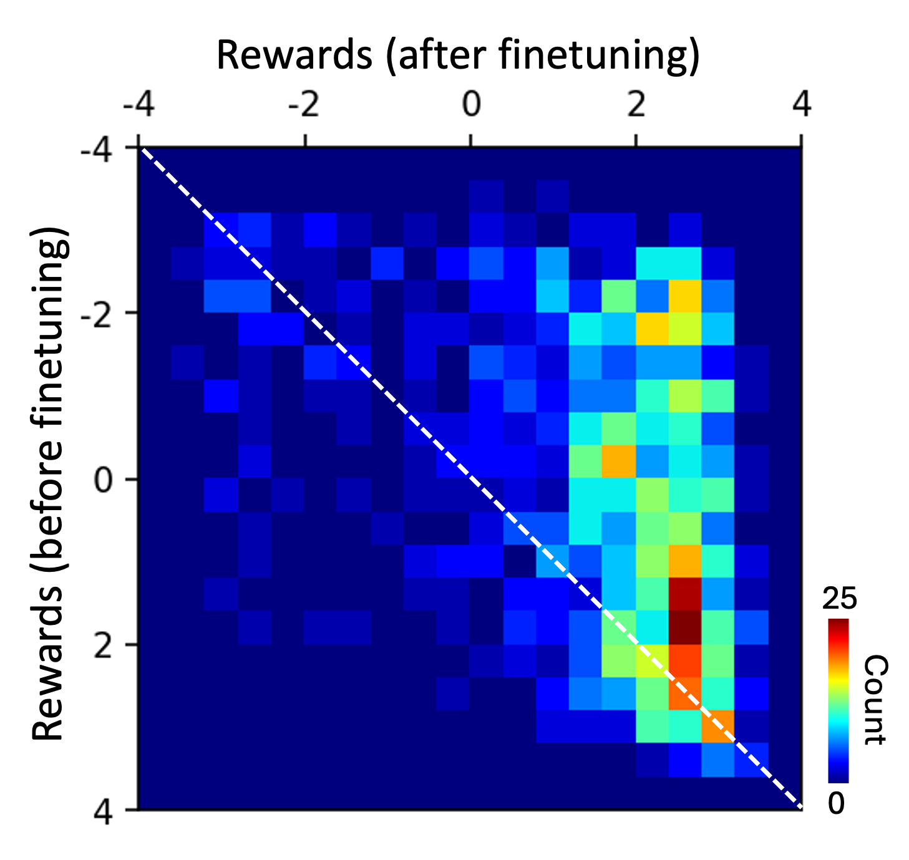

## General
This example demonstrates finetuning language models through reinforcement learning from human feedback for language alignment.

## Dataset
The original dataset has around 40K movie reviews with positive and negative reviews labeled as 1 and 0, respectively. In this example, 1K positive reviews and 1K negative reviews are sampled for finetuning the model. The dataset is splited into three parts, 60% for training, 20% for validation and 20% for testing. 

Dataset Link: https://www.kaggle.com/datasets/yasserh/imdb-movie-ratings-sentiment-analysis

## Model
Finetuning language models via RLFH (Reinforcement Learning from Human Feedback) mainly consists of three steps, including supervised finetuning, reward model training and reinforcement learning from human feedback finetuning.

Step 1: supervised finetuning  

This step focus on finetuning a pretrained model for language modeling on the dataset we are interested in. The language model here is GPT2 (Generative Pre-Training) Small model with a language modeling head (GPT2LMHeadModel) from Hugging Face. The model consists of the embedding layer, 12 decoder layers. The weights of the 10th and 11th decoder layers (index starting from 0) are finetuned for 10 epoches, with all other model parameters frozen.

> Model input: {Prompt}; Model output: {Response}

Here, both {Prompt} and {Response} indicate a sequence of words.

Step 2: reward model training  

This step focus on traning a reward model for generating a scalar value for each prompt response pair, which will be further used in the step 3. The reward model here is BERT (Bidirectional Encoder Representations from Transformers) Base model with a sequence classification head (BertForSequenceClassification) from Hugging Face. The model consists of the embedding layer, 12 encoder layers, and classification layer. The weights of the 11th encoder layer (index start from 0) and the classification layer are finetuned for 20 epoches, with all other model parameters frozen.

> Model input: {Prompt} + {Response}; Model output: reward

Here, input represents the combination of the prompt and response, and the output is a scalar value indicating reward.

Step 3: reinforcement learning from human feedback finetuning  

This step focus on further finetuning the model from step 1 (SFT model) according to the rewards generated by the reward model from step 2. The PPO algorithm is adopted for the purpose of finetuning. For each prompt, one response is generated from the current model. Moreover, to compare with the SFT model, the probability of that response conditioned on the prompt is also calculated for the SFT model. The objective function includes the rewards of the prompt response pair from current model and the KL divergence for response probabilities from both models. The KL divergence is a penalty term to prevent rapid updates of the model parameters. 

## Evaluation

### Supervised finetuning

| | Loss | Perplexity |
| --- | --- | --- |
| Train | 3.233 | 25.358 |
| Validation | 3.536 | 34.343 |
| Test | 3.507 | 33.362 |

**Table 1. Loss and perplexity on train/validation/test dataset.**

### Reward model training

| | Accuracy | Precison | Recall | F1 | 
| --- | --- | --- | --- | --- |
| Train | 0.955 | 0.955 | 0.955 | 0.955 |
| Validation | 0.878 | 0.877 | 0.876 | 0.877 |
| Test | 0.905 | 0.905 | 0.905 | 0.905 |

**Table 1. Summary of various metrics on train/validation/test dataset.**

| | 0 | 1 |
| --- | --- | --- |
| 0 | 179 | 21 |
| 1 | 17 | 183 |

**Table 2. Confusion matrix on test dataset. 1 and 0 represents the positive and negative reviews, respectively.**

### Reinforcement learning from human feedback
 

**Figure 3. Average rewards on the train dataset during training.**

| SFT Model | RL Model |
|---|---|
|  |  |

**Figure 4. Rewards on the test dataset from SFT model (left) and RL model (right).**

**Figure 5. Reward map for SFT and RL model.**

Figure 3 shows the increasing average rewards during training, indicating prompt reponse pairs gradaully become more positive. Figure 4 shows the distribution of rewards for each question reponses pair, generated by the SFT model and RL model, from the test dataset. For the SFT model, the reward distribution is symmetric and flat indicating the SFT model does not have any bias to generate postive or negative response. Nonetheless, for the RL model, the reward distribution mainly concentrates on the right end, indicating a tendency to generate positive responses given the same prompts. Figure 5 furthers shows the 2d reward distribution formed by rewards of SFT and RL model. For most of cases, no matter SFT model generates positive or negative responses, the RL model tends to increases the postiveness of the responses. Interestingly, there are also few cases where the SFT model generates positive responses while the RL model generates negative responses.

## Reference
1. https://huggingface.co/docs/transformers/en/model_doc/bert
2. Kenton, Jacob Devlin Ming-Wei Chang, and Lee Kristina Toutanova. "Bert: Pre-training of deep bidirectional transformers for language understanding." Proceedings of naacL-HLT. Vol. 1. 2019.
