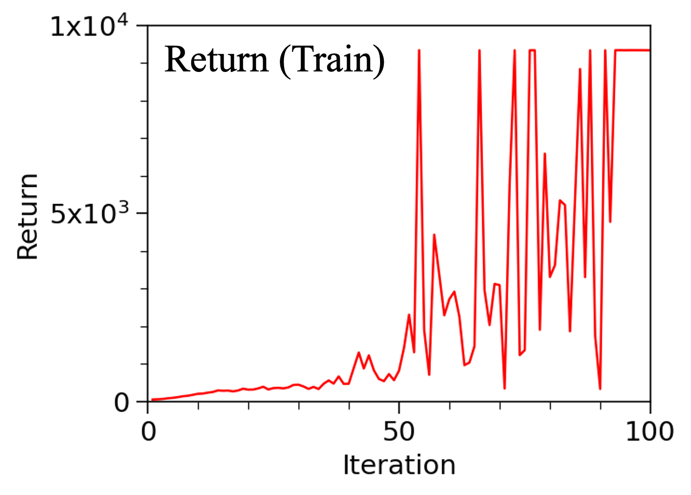
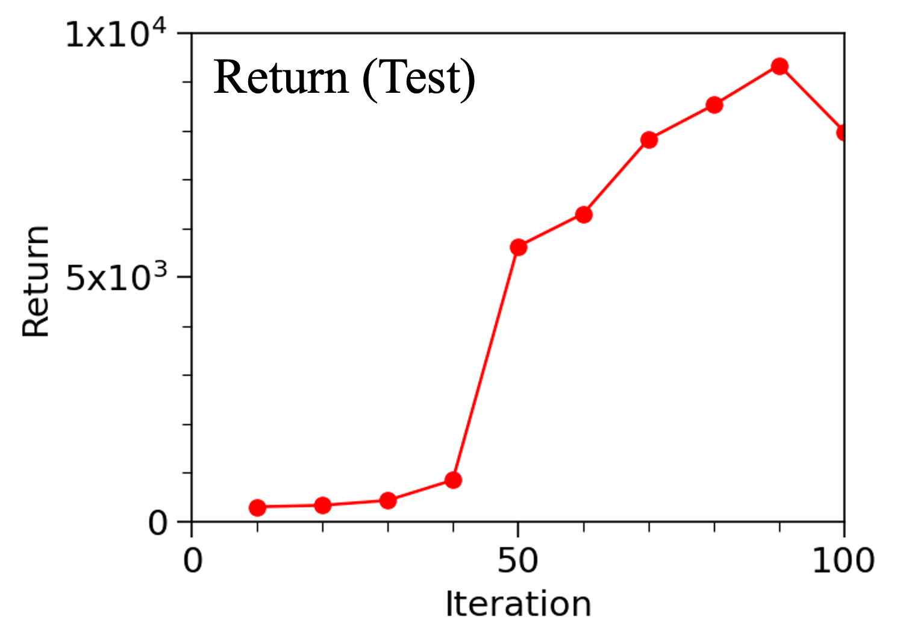
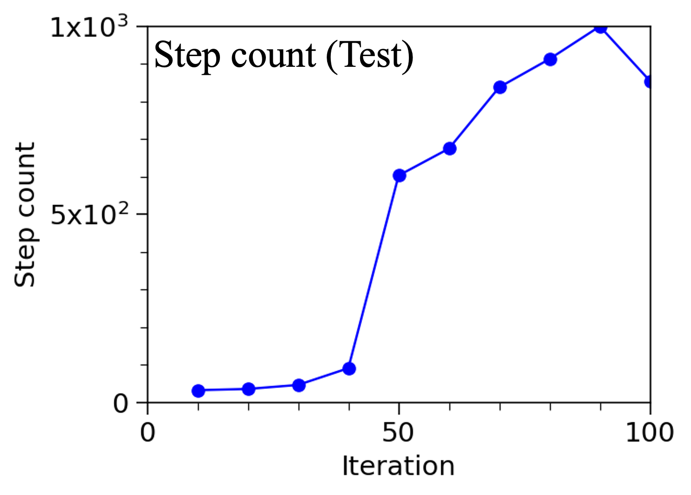

## General
This example demonstrates training uni-agent system using reinforcement learning algorithms. 

## Dataset
The simulation environment is Inverted Double Pendulum of gymnasium from OpenAI. The observations are 9 dimensional which consider the cart position/velocity, cart-pole angle/angle velocity, pole-pole angle/angle velocity, etc. The actions are 1 dimensional which consider the force applied on the cart. The reward consists of three parts: (1) alive bonus accounts for how long the system survives, (2) distance penalty accounts for the penalty from the second pendulum movements, (3) velocity penalty accounts for the penalty from large angular velocities. 

The agent is trained for 100 iterations, each of which considers 1000 frames. Thus, 100K frames are used totally.

Simulation Environment Link: https://gymnasium.farama.org/index.html

## Model
The model is PPO (Proximal Policy Optimization) which belongs to policy gradient algorithm. It consists of an actor model and critic model. The actor model approximates a policy function for generating the action distributions. The critic model approximates a value function for evaluating the goodness of the selected action given the state. The model is optimized on the clipped surrogate objective function to avoid rapid updates on the parameters. For each iteration, a number of trajectories (a sequence of states and actions) are generated based on the current policy. Using quantities including action probalities, advantages, predicted values and returns, the policy and value model parameters are optimized. The updated policy is used again to generate new trajectories for the optimizetion at the next iteration.

## Evaluation
| Train Return | Train Step Count |
|---|---|
|  |  |

**Figure 1. Average return and number of steps during training.**

| Test Return | Test Step Count |
|---|---|
|  |  |

**Figure 2. Average return and number of steps during testing.**

| 40 Iterations | 90 Iterations |
|---|---|
|<video src="https://github.com/user-attachments/assets/5774f724-26c2-416f-82bc-0e728f770125" height="200"></video> | <video src="https://github.com/user-attachments/assets/819be0f8-5c3c-4104-b463-e6a56da8c6de" height="200"></video> |

**Video 1. Movements of inverted double pendulum from models after training for 40 iterations (left) and 90 iterations (right).**

Figure 1,2 shows the average return and number of steps during training and testing stages. During training, the actor model is saved every 10 iterations. During testing, each saved model is used to generated 100 trajectories, each of which has at most 1000 steps. The average returns and number of steps are shown in Figure 2 for various checkpoints, indicating the enhanced model performance with the increasing of training iterations. 

The Video 1 shows two videos recording the movements of the inverted double pendulum from the model trained for 40 and 90 iterations, respectively. After training for 40 iterations (left video), the double pendulum can maintain stable within few steps but eventaully fails. However, after training for 90 iterations (right video), the double pendulum keeps stable during the 1000 steps applied.

## Reference
1. https://gymnasium.farama.org/index.html
2. Schulman, John, et al. "Proximal policy optimization algorithms." arXiv preprint arXiv:1707.06347 (2017).
3. https://pytorch.org/tutorials/intermediate/reinforcement_ppo.html
