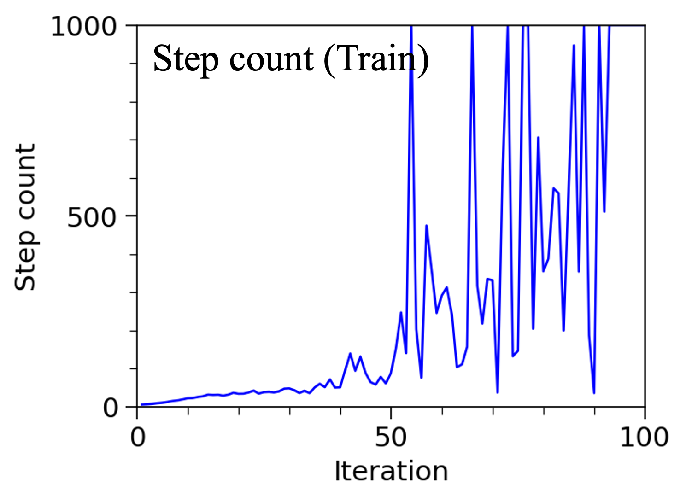

## General
This example demonstrates training uni-agent system using reinforcement learning algorithms. 

## Dataset
The simulation environment is Inverted Double Pendulum of gymnasium from OpenAI. The observations are 9 dimensional which consider the cart position/velocity, cart-pole angle/angle velocity, pole-pole angle/angle velocity, etc. The actions are 1 dimensional which consider the force applied on the cart. The reward consists of three parts: (1) alive bonus accounts for how long the system survives, (2) distance penalty accounts for the penalty from the second pendulum movements, (3) velocity penalty accounts for the penalty from large angular velocities. 

The agent is trained for 100 iterations, each of which considers 1000 frames. Thus, 100K frames are used totally.

Simulation Environment Link: https://gymnasium.farama.org/index.html

## Model
The model is PPO (Proximal Policy Optimization) which is a policy gradient algorithm. 

## Evaluation
| Train Return | Train Step Count |
|---|---|
|  |  |

**Figure 1. Average return and number of steps during training.**

| Test Return | Test Step Count |
|---|---|
|  |  |

**Figure 2. Average return and number of steps during testing.**

| 40 Iterations | 90 Iterations |
|---|---|
|<video src="https://github.com/user-attachments/assets/5774f724-26c2-416f-82bc-0e728f770125" height="200"></video> | <video src="https://github.com/user-attachments/assets/819be0f8-5c3c-4104-b463-e6a56da8c6de" height="200"></video> |

**Video 1. Movements of inverted double pendulum from models after training for 40 iterations (left) and 90 iterations (right).**

Through finetuning, the model achieves an accuracy of 90.5% on the test dataset. From the confusion matrix in Table 2, the model exhibits similar performance on detecting positive and negative reviews on this balanced dataset

## Reference
1. https://huggingface.co/docs/transformers/en/model_doc/bert
2. Kenton, Jacob Devlin Ming-Wei Chang, and Lee Kristina Toutanova. "Bert: Pre-training of deep bidirectional transformers for language understanding." Proceedings of naacL-HLT. Vol. 1. 2019.
